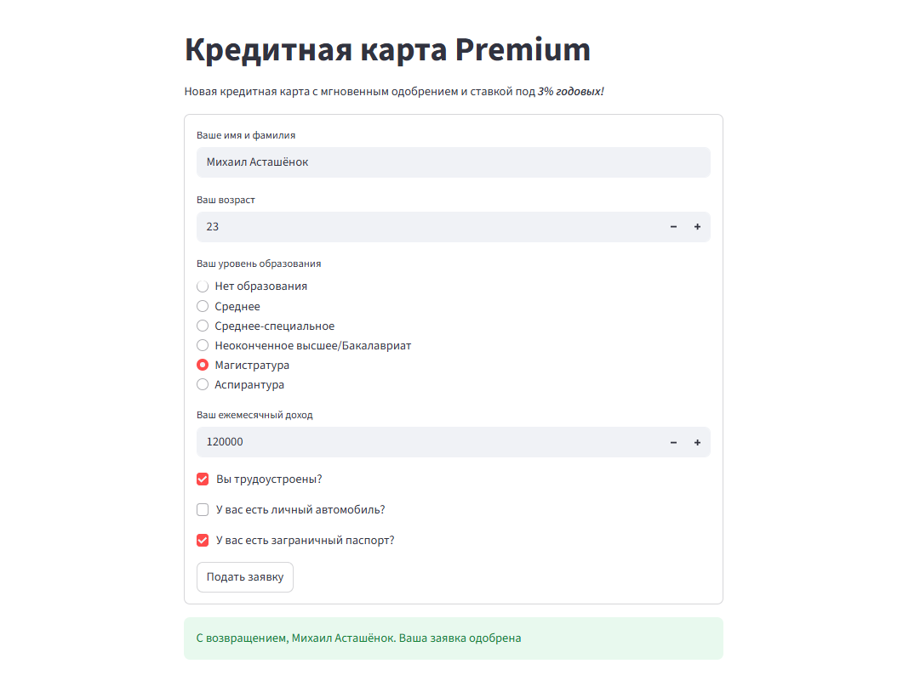
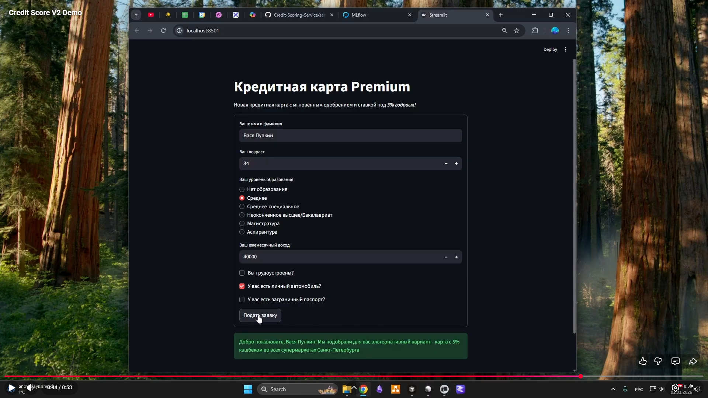
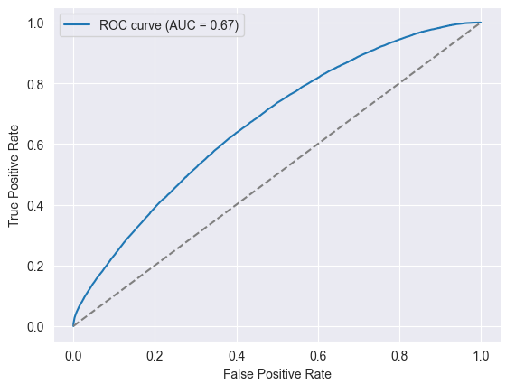
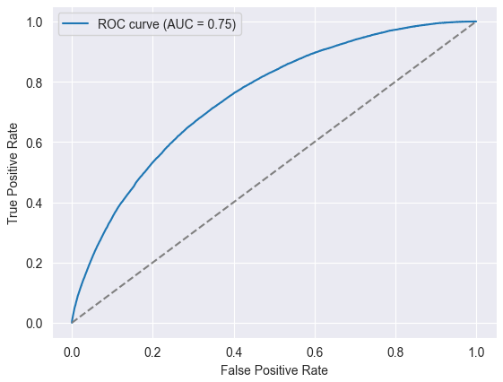

# 🤖💵🏦 Web-сервис для кредитного скоринга клиентов банка

## 📖 Содержание
- 📌 Обновления
    - Версия №3 (янв. 2026)
    - Версия №2 (янв. 2026)
    - Версия №1 (дек. 2025)
- 👔 Бизнес-кейс
- 🖥️ Как запустить сервис?
- 🛠️ Стек
- 📈 Результаты
- 🤖 Модель классификации клиентов

## 📌 Обновления 
### Версия №3 (янв. 2026) - Улучшения & новые эксперименты
- Общее улучшение документации сервиса.
- Оптимизация бизнес-логики: 
    - Упрощена структура кода.
    - Удален неиспользуемый функционал.
    - Улучшена работа с директориями сервиса.
- Оптимизация Docker: docker-изображения стали на 10% легче.
- Проведены эксперименты с state-of-the-art моделью на базе предобученных трансформеров для решения задач классического машинного обучения - [TabPFN](https://github.com/PriorLabs/TabPFN). Наблюдения и результаты следующие:
    - Данная модель дообучается на тренировочной выборке за считаные секунды даже на обывательском процессоре. Однако inference модели даже при работе на GPU отрабатывает намного медленнее, нежели решение от CatBoost (примерно в 10.000 раз).
    - Хоть модель и достигла приемлемых метрик, качество классификации все еще ниже, чем у CatBoost (на 5-10%).
    - **Вывод**: модель показала себя хуже по качеству и скорости инференса, чем CatBoost, поэтому на данном этапе эта модель не подлежит интеграции. Однако tradeoff между скоростью обучения и качеством классификации указывает на огромный потенциал TabPFN в решении иных задач классического ML. Взято на заметку для решения будущих задач.

### Версия №2 (янв. 2026) - Продукт
- Разработана система экспериментирования и мониторинга обучения различных моделей (Optuna, MLFlow).
- Разработана база данных (PostgreSQL) для хранения информации о "старых" клиентах банка.
- Внедрена система, по которой при наличии информации о клиенте в базе данных банка будет подобрана специальная модель прогнозирования.
- В ходе экспериментов были достигнуты следующие результаты:
    - Была обучена модель, которая на 6% повысила качество классификации для новых клиентов банка (с 61% AUROC до 67%).
    - Была обучена модель для "старых" клиентов банка, которая достигла качества классификации в 75% AUROC.

Обе модели - модели градиентного бустинга [CatBoost](https://catboost.ai/).
- Сервис контейнеризирован с помощью Docker Compose (см. ниже "Как запустить сервис?").

### Версия №1 (дек. 2025) - Минимальное решение
- Минимальное локальное веб-приложение для классификации клиентов. Модель классификатора - RandomForest (Scikit-Learn). Качество классификации достигло 61% AUROC.


## 👔 Бизнес-кейс
Наш банк запускает **новую программу кредитных карт с мгновенным одобрением**, низкими процентами по кредиту, многочисленными скидками и кэш-беком у магазинов-партнеров. При этом наш банк терпит убытки и **находится на грани кризиса**, поэтому важно отбирать клиентов с хорошей кредитной историей, которые **с малой вероятностью потерпят [дефолт](https://ru.wikipedia.org/wiki/%D0%94%D0%B5%D1%84%D0%BE%D0%BB%D1%82)**.

Для отбора клиентов была создана онлайн-анкета, где клиент вводит свои данные и система на их основе сделает вывод, стоит ли предоставлять данному клиенту услуги по новой программе, или стоит предложить ему более безопасные для банка варианты кредитных программ.

Для того, чтобы повысить конверсию анкеты, анкета была создана максимально простой и быстрой для заполнения.

Для потенциального повышения качества прогнозирования была заведена база данных клиентов банка, которая позволила при наличии информации о клиенте в базе данных подать системе прогнозирования дополнительные даные о клиенте.

## 🖥️ Как запустить сервис?
Для развертывания приложения необходимо наличие установленного [Docker](https://www.docker.com/products/docker-desktop/) на рабочей машине.

1. Клонируем репозиторий
```bash
git clone git@github.com:mikeasta/Credit-Scoring-Service.git
```

2. Разворачиваем контейнер
```bash
cd Credit-Scoring-Service
docker compose -f docker/docker-compose.yml up --build
```

3. Готово! Веб-сервис доступен по адресу `127.0.0.1:8501`

## 🛠️ Стек
**Сервис**
- [Python](https://www.python.org/downloads/release/python-3120/) 
- [FastAPI](https://fastapi.tiangolo.com/) 
- [Streamlit](https://docs.streamlit.io/) 
- [PostgreSQL](https://www.postgresql.org/)
- [Docker](https://www.docker.com/products/docker-desktop/) 
- [CatBoost](https://catboost.ai/)
- [Pandas](https://pandas.pydata.org/) 

**Эксперименты (в дополнение к технологиям выше)**
- [Jupyter Notebook](https://jupyter.org/)
- [Scikit-Learn](https://scikit-learn.org/stable/) 
- [XGBoost](https://xgboost.readthedocs.io/en/stable/)
- [LightGBM](https://lightgbm.readthedocs.io/en/stable/) 
- [TabPFN](https://github.com/PriorLabs/TabPFN)
- [Optuna](https://optuna.org/#code_examples)
- [MLFlow](https://mlflow.org/docs/latest/ml/getting-started/)
- [Matplotlib](https://matplotlib.org/)
- [Seaborn](https://seaborn.pydata.org/)

## 📈 Результаты 
Был разработан веб-сервис, в котором клиент может указать свои данные и получить решение об одобрении ему новой кредитной программы.

Нажмите на изображение ниже, чтобы перейти на **YouTube-видео**.

[](https://youtu.be/2lX4aBlDQ-E)

## 🤖 Модель классификации клиентов
В ходе экспериментирования с различными видами моделей и оптимизацией их параметров был отобран на основе модели [CatBoost](https://catboost.ai/). В ходе обучения в качестве основной оптимизируемой метрики был выбран **Precision-Recall AUC**, чтобы максимально понизить количество неправильно классифицированных клиентов, потерпящих дефолт, с учетом сильного дисбаланса данных (процент дефолтов в обучающей выборке составил 13%).

Для работы с новыми и старыми клиентами банка был обучен свой классификатор.

### Качество классификатора для новых клиентов
Качество нового классификатора (v2, v3) по сравнению со старым (v1) было повышено с 61% AUROC до 67%


### Качество классификатора для старых клиентов
Качество нового классификатора (v2, v3) для старых клиентов достигло отметки в 75% AUROC

